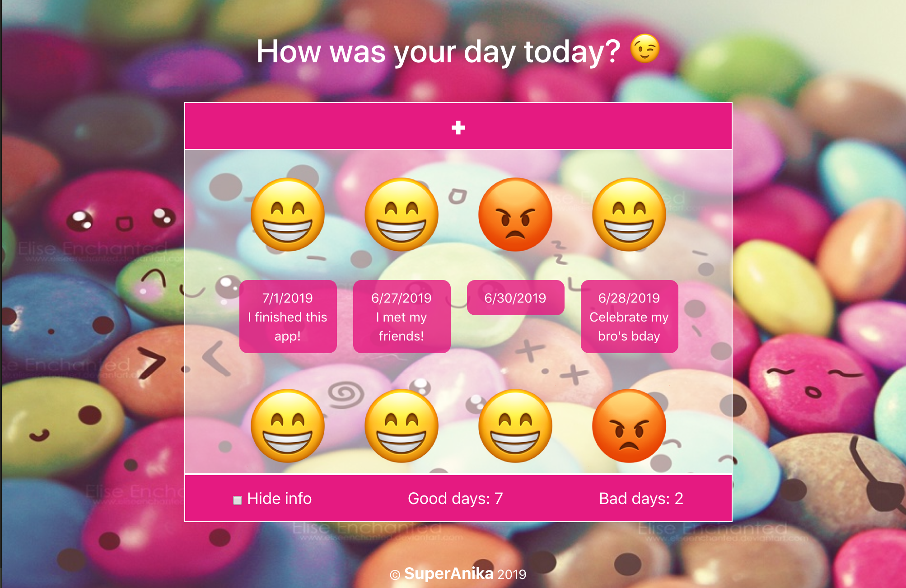
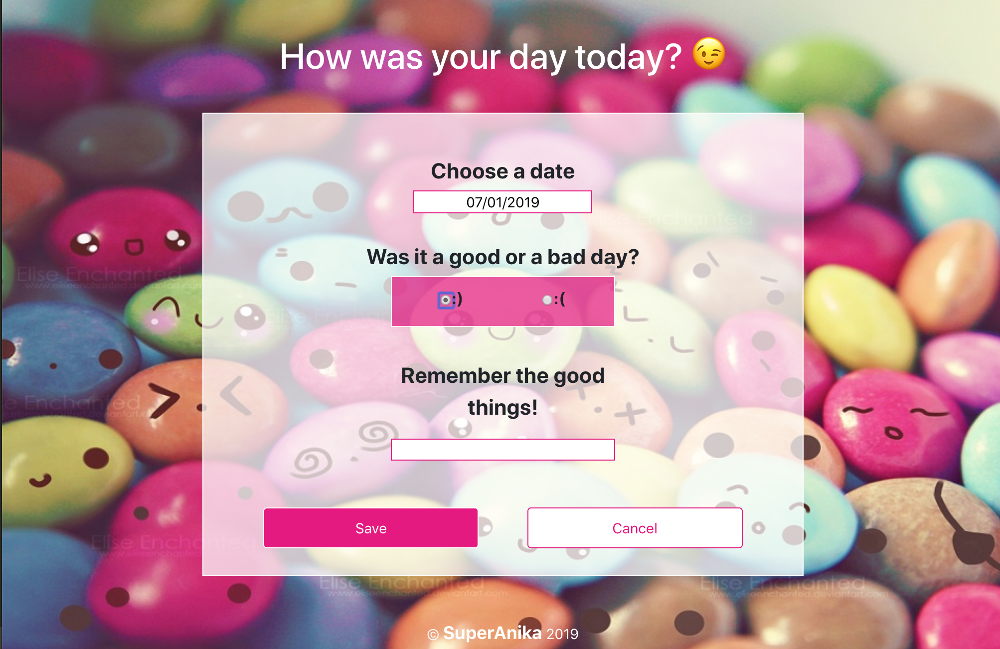
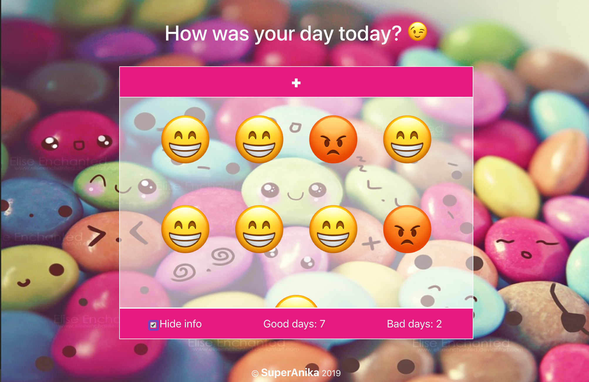

# Life calendar by SuperAnika 

Do you think you had a bad year? Now you can check that it was not so bad!  With the life calendar, you can add each day to our list and save if it was good or not, so at the end of the year you will see how many bad days you really had.


 


This SPA has two components, the list of icons and the edit view. You can access the edit view clicking on the + button.  On the editor, you will choose the date you want to add to the list, if it was a good or a bad day, and you can leave a message just in case it was a good day, bad things is better to forget them!  You can't save the same date twice, a error message will alert you in that case.  The cancel button will take you to the home page again.





Back to the home page, we have the Add button, as we saw before, the list of emojis with the information provided and a checkbox where you can hide the inforation and show only the emojis.  You can find also how many good days or bad days you already added.





This site has a responsive design so it can fit all devices' sizes.

You can clone this project clicking on the green clone button or with this link:

https://github.com/Adalab/f-online-life-calendar-superanika.git

This project was bootstrapped with [Create React App](https://github.com/facebook/create-react-app) and Sass and you should run "npm install" and "npm start" on your Terminal to init it.

The structure is as follows:
```
/
`- src
   |- components
   |    |- CalendarApp
   |    |  |- CalendarApp.js
   |    |  |- CalendarApp.scss
   |    |- Edit
   |    |  |- Edit.js
   |    |  |- Edit.scss
   |    |- Footer
   |    |  |- Footer.js
   |    |  |- Footer.scss
   |    |- Header
   |    |  |- Header.js
   |    |  |- Header.scss
   |    |- Home
   |    |  |- Home.js
   |    |  |- Home.scss
   |    |-Helper.js
   |- images
   |- App.js
   |- App.scss
   |- index.js
   |- index.css
 ```  
 
